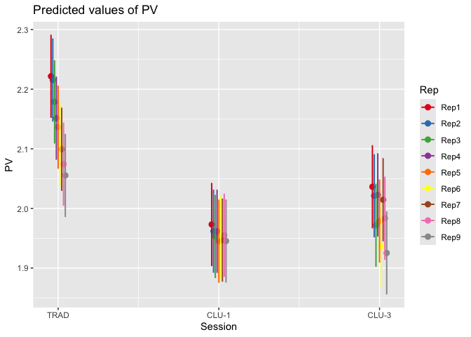
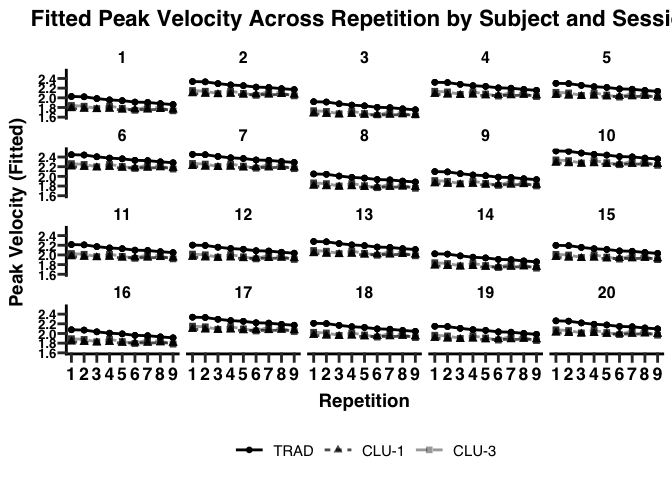
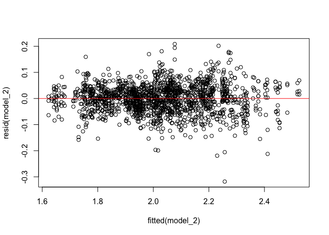
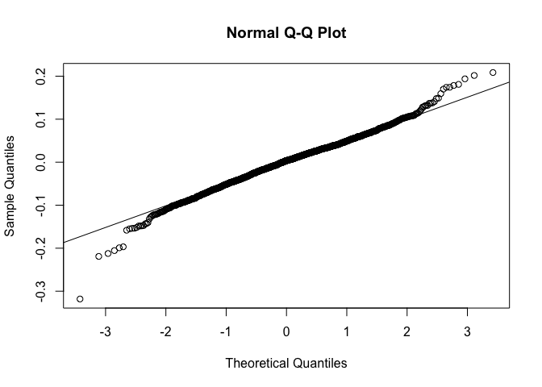
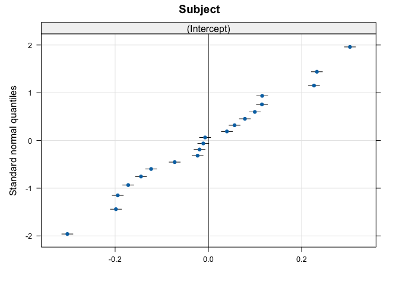
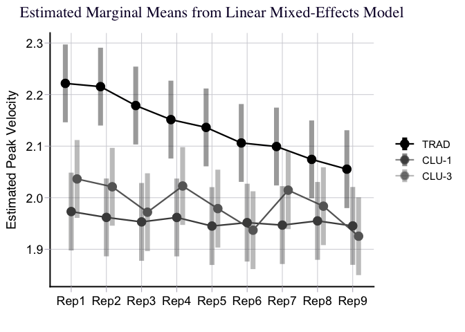
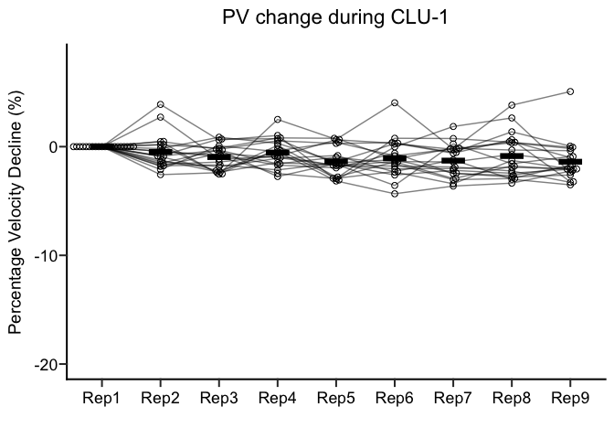
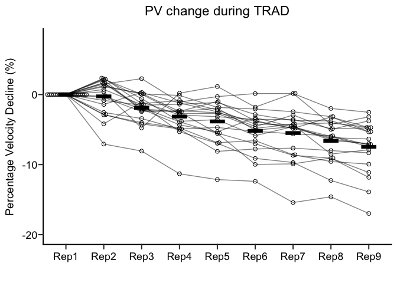
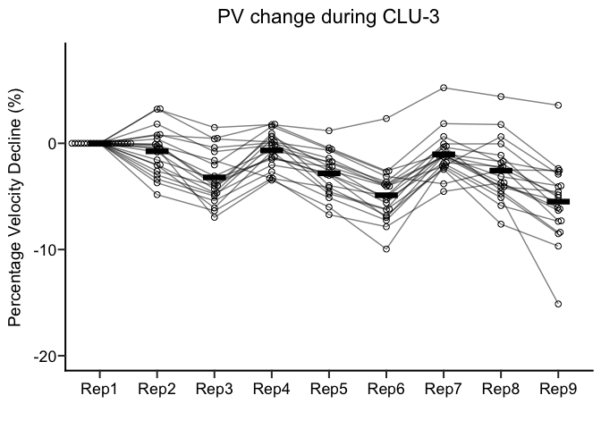
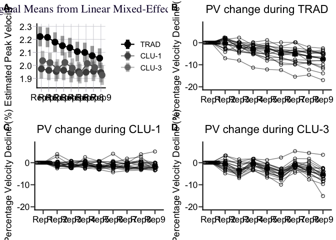

R Markdown
================
Yoshi Nagatani
2026-05-05

``` r
# Load necessary libraries
library(readr)        # read_csv()
library(dplyr)        # data manipulation
```

    ## 
    ## Attaching package: 'dplyr'

    ## The following objects are masked from 'package:stats':
    ## 
    ##     filter, lag

    ## The following objects are masked from 'package:base':
    ## 
    ##     intersect, setdiff, setequal, union

``` r
library(ggplot2)      # plotting
library(lme4)         # linear mixed models
```

    ## Loading required package: Matrix

``` r
library(emmeans)      # estimated marginal means and pairwise comparisons
```

    ## Welcome to emmeans.
    ## Caution: You lose important information if you filter this package's results.
    ## See '? untidy'

``` r
library(ggprism)      # theme_prism()
library(rstatix)      # get_summary_stats()
```

    ## Registered S3 method overwritten by 'car':
    ##   method           from
    ##   na.action.merMod lme4

    ## 
    ## Attaching package: 'rstatix'

    ## The following object is masked from 'package:stats':
    ## 
    ##     filter

``` r
library(ggpubr)       # ggarrange()
library(ggbeeswarm)   # geom_beeswarm()
library(performance)  # check_model()
library(lattice)      # qqmath() for random effects plot
library(effectsize)   # effectsize::eta_squared()
```

    ## 
    ## Attaching package: 'effectsize'

    ## The following objects are masked from 'package:rstatix':
    ## 
    ##     cohens_d, eta_squared

``` r
library(lattice)
library(sjPlot)
```

    ## 
    ## Attaching package: 'sjPlot'

    ## The following object is masked from 'package:ggplot2':
    ## 
    ##     set_theme

``` r
citation("lme4")
```

    ## To cite lme4 in publications use:
    ## 
    ##   Douglas Bates, Martin Maechler, Ben Bolker, Steve Walker (2015).
    ##   Fitting Linear Mixed-Effects Models Using lme4. Journal of
    ##   Statistical Software, 67(1), 1-48. doi:10.18637/jss.v067.i01.
    ## 
    ## A BibTeX entry for LaTeX users is
    ## 
    ##   @Article{,
    ##     title = {Fitting Linear Mixed-Effects Models Using {lme4}},
    ##     author = {Douglas Bates and Martin M{\"a}chler and Ben Bolker and Steve Walker},
    ##     journal = {Journal of Statistical Software},
    ##     year = {2015},
    ##     volume = {67},
    ##     number = {1},
    ##     pages = {1--48},
    ##     doi = {10.18637/jss.v067.i01},
    ##   }

``` r
packageVersion("lme4")
```

    ## [1] '2.0.1'

``` r
citation("emmeans")
```

    ## To cite package 'emmeans' in publications use:
    ## 
    ##   Lenth R, Piaskowski J (2026). _emmeans: Estimated Marginal Means, aka
    ##   Least-Squares Means_. doi:10.32614/CRAN.package.emmeans
    ##   <https://doi.org/10.32614/CRAN.package.emmeans>. R package version
    ##   2.0.3, <https://CRAN.R-project.org/package=emmeans>.
    ## 
    ## A BibTeX entry for LaTeX users is
    ## 
    ##   @Manual{,
    ##     title = {emmeans: Estimated Marginal Means, aka Least-Squares Means},
    ##     author = {Russell V. Lenth and Julia Piaskowski},
    ##     year = {2026},
    ##     note = {R package version 2.0.3},
    ##     url = {https://CRAN.R-project.org/package=emmeans},
    ##     doi = {10.32614/CRAN.package.emmeans},
    ##   }

``` r
packageVersion("emmeans")
```

    ## [1] '2.0.3'

``` r
# Read and prepare data 
df <- read_csv("~/Documents/1 Projects/PhD folder/PhD_Projects/Study 2/Analysis_Sheet/Excel/Trial.csv")
```

    ## Rows: 1620 Columns: 5

    ## ── Column specification ────────────────────────────────────────────────────────
    ## Delimiter: ","
    ## chr (2): Session, Rep
    ## dbl (3): Subject, Set, PV
    ## 
    ## ℹ Use `spec()` to retrieve the full column specification for this data.
    ## ℹ Specify the column types or set `show_col_types = FALSE` to quiet this message.

``` r
df$Session <- factor(df$Session,
                     levels = c("TRAD","CLU_1","CLU_3"),
                     labels = c("TRAD","CLU_1","CLU_3"))
df$Rep <- factor(df$Rep,
                     levels = c("Rep1","Rep2","Rep3","Rep4","Rep5","Rep6", "Rep7", "Rep8", "Rep9"),
                     labels = c("Rep1","Rep2","Rep3","Rep4","Rep5","Rep6", "Rep7", "Rep8", "Rep9"))
df$Set <- factor(df$Set,
                 levels = c("1","2","3"),
                 labels = c("Set1","Set2","Set3"))
df <- df %>%
  mutate(Session = recode(Session,
                          "CLU_3" = "CLU-3",
                          "CLU_1" = "CLU-1"))

# Fit models
model_1 <- lmer(PV ~ 1 + Session + Rep + (1 | Subject), data = df, REML=FALSE)
model_2 <- lmer(PV ~ 1 + Session * Rep + (1 | Subject), data = df, REML=FALSE)

model_3 <- lmer(PV ~ 1 + Session * Rep * Set + (1 | Subject), data = df, REML=FALSE)
model_4 <- lmer(PV ~ 1 + Session + Rep + Set + (1 | Subject), data = df, REML=FALSE)
# Summarise everything in the table
tab_model(model_2)
```

<table style="border-collapse:collapse; border:none;">

<tr>

<th style="border-top: double; text-align:center; font-style:normal; font-weight:bold; padding:0.2cm;  text-align:left; ">

 
</th>

<th colspan="3" style="border-top: double; text-align:center; font-style:normal; font-weight:bold; padding:0.2cm; ">

PV
</th>

</tr>

<tr>

<td style=" text-align:center; border-bottom:1px solid; font-style:italic; font-weight:normal;  text-align:left; ">

Predictors
</td>

<td style=" text-align:center; border-bottom:1px solid; font-style:italic; font-weight:normal;  ">

Estimates
</td>

<td style=" text-align:center; border-bottom:1px solid; font-style:italic; font-weight:normal;  ">

CI
</td>

<td style=" text-align:center; border-bottom:1px solid; font-style:italic; font-weight:normal;  ">

p
</td>

</tr>

<tr>

<td style=" padding:0.2cm; text-align:left; vertical-align:top; text-align:left; ">

(Intercept)
</td>

<td style=" padding:0.2cm; text-align:left; vertical-align:top; text-align:center;  ">

2.22
</td>

<td style=" padding:0.2cm; text-align:left; vertical-align:top; text-align:center;  ">

2.15 – 2.29
</td>

<td style=" padding:0.2cm; text-align:left; vertical-align:top; text-align:center;  ">

<strong>\<0.001</strong>
</td>

</tr>

<tr>

<td style=" padding:0.2cm; text-align:left; vertical-align:top; text-align:left; ">

SessionCLU-1
</td>

<td style=" padding:0.2cm; text-align:left; vertical-align:top; text-align:center;  ">

-0.25
</td>

<td style=" padding:0.2cm; text-align:left; vertical-align:top; text-align:center;  ">

-0.27 – -0.23
</td>

<td style=" padding:0.2cm; text-align:left; vertical-align:top; text-align:center;  ">

<strong>\<0.001</strong>
</td>

</tr>

<tr>

<td style=" padding:0.2cm; text-align:left; vertical-align:top; text-align:left; ">

SessionCLU-3
</td>

<td style=" padding:0.2cm; text-align:left; vertical-align:top; text-align:center;  ">

-0.19
</td>

<td style=" padding:0.2cm; text-align:left; vertical-align:top; text-align:center;  ">

-0.20 – -0.17
</td>

<td style=" padding:0.2cm; text-align:left; vertical-align:top; text-align:center;  ">

<strong>\<0.001</strong>
</td>

</tr>

<tr>

<td style=" padding:0.2cm; text-align:left; vertical-align:top; text-align:left; ">

Rep \[Rep2\]
</td>

<td style=" padding:0.2cm; text-align:left; vertical-align:top; text-align:center;  ">

-0.01
</td>

<td style=" padding:0.2cm; text-align:left; vertical-align:top; text-align:center;  ">

-0.03 – 0.01
</td>

<td style=" padding:0.2cm; text-align:left; vertical-align:top; text-align:center;  ">

0.529
</td>

</tr>

<tr>

<td style=" padding:0.2cm; text-align:left; vertical-align:top; text-align:left; ">

Rep \[Rep3\]
</td>

<td style=" padding:0.2cm; text-align:left; vertical-align:top; text-align:center;  ">

-0.04
</td>

<td style=" padding:0.2cm; text-align:left; vertical-align:top; text-align:center;  ">

-0.06 – -0.02
</td>

<td style=" padding:0.2cm; text-align:left; vertical-align:top; text-align:center;  ">

<strong>\<0.001</strong>
</td>

</tr>

<tr>

<td style=" padding:0.2cm; text-align:left; vertical-align:top; text-align:left; ">

Rep \[Rep4\]
</td>

<td style=" padding:0.2cm; text-align:left; vertical-align:top; text-align:center;  ">

-0.07
</td>

<td style=" padding:0.2cm; text-align:left; vertical-align:top; text-align:center;  ">

-0.09 – -0.05
</td>

<td style=" padding:0.2cm; text-align:left; vertical-align:top; text-align:center;  ">

<strong>\<0.001</strong>
</td>

</tr>

<tr>

<td style=" padding:0.2cm; text-align:left; vertical-align:top; text-align:left; ">

Rep \[Rep5\]
</td>

<td style=" padding:0.2cm; text-align:left; vertical-align:top; text-align:center;  ">

-0.09
</td>

<td style=" padding:0.2cm; text-align:left; vertical-align:top; text-align:center;  ">

-0.10 – -0.07
</td>

<td style=" padding:0.2cm; text-align:left; vertical-align:top; text-align:center;  ">

<strong>\<0.001</strong>
</td>

</tr>

<tr>

<td style=" padding:0.2cm; text-align:left; vertical-align:top; text-align:left; ">

Rep \[Rep6\]
</td>

<td style=" padding:0.2cm; text-align:left; vertical-align:top; text-align:center;  ">

-0.12
</td>

<td style=" padding:0.2cm; text-align:left; vertical-align:top; text-align:center;  ">

-0.14 – -0.10
</td>

<td style=" padding:0.2cm; text-align:left; vertical-align:top; text-align:center;  ">

<strong>\<0.001</strong>
</td>

</tr>

<tr>

<td style=" padding:0.2cm; text-align:left; vertical-align:top; text-align:left; ">

Rep \[Rep7\]
</td>

<td style=" padding:0.2cm; text-align:left; vertical-align:top; text-align:center;  ">

-0.12
</td>

<td style=" padding:0.2cm; text-align:left; vertical-align:top; text-align:center;  ">

-0.14 – -0.10
</td>

<td style=" padding:0.2cm; text-align:left; vertical-align:top; text-align:center;  ">

<strong>\<0.001</strong>
</td>

</tr>

<tr>

<td style=" padding:0.2cm; text-align:left; vertical-align:top; text-align:left; ">

Rep \[Rep8\]
</td>

<td style=" padding:0.2cm; text-align:left; vertical-align:top; text-align:center;  ">

-0.15
</td>

<td style=" padding:0.2cm; text-align:left; vertical-align:top; text-align:center;  ">

-0.17 – -0.13
</td>

<td style=" padding:0.2cm; text-align:left; vertical-align:top; text-align:center;  ">

<strong>\<0.001</strong>
</td>

</tr>

<tr>

<td style=" padding:0.2cm; text-align:left; vertical-align:top; text-align:left; ">

Rep \[Rep9\]
</td>

<td style=" padding:0.2cm; text-align:left; vertical-align:top; text-align:center;  ">

-0.17
</td>

<td style=" padding:0.2cm; text-align:left; vertical-align:top; text-align:center;  ">

-0.19 – -0.15
</td>

<td style=" padding:0.2cm; text-align:left; vertical-align:top; text-align:center;  ">

<strong>\<0.001</strong>
</td>

</tr>

<tr>

<td style=" padding:0.2cm; text-align:left; vertical-align:top; text-align:left; ">

SessionCLU-1:RepRep2
</td>

<td style=" padding:0.2cm; text-align:left; vertical-align:top; text-align:center;  ">

-0.01
</td>

<td style=" padding:0.2cm; text-align:left; vertical-align:top; text-align:center;  ">

-0.03 – 0.02
</td>

<td style=" padding:0.2cm; text-align:left; vertical-align:top; text-align:center;  ">

0.720
</td>

</tr>

<tr>

<td style=" padding:0.2cm; text-align:left; vertical-align:top; text-align:left; ">

SessionCLU-3:RepRep2
</td>

<td style=" padding:0.2cm; text-align:left; vertical-align:top; text-align:center;  ">

-0.01
</td>

<td style=" padding:0.2cm; text-align:left; vertical-align:top; text-align:center;  ">

-0.04 – 0.02
</td>

<td style=" padding:0.2cm; text-align:left; vertical-align:top; text-align:center;  ">

0.528
</td>

</tr>

<tr>

<td style=" padding:0.2cm; text-align:left; vertical-align:top; text-align:left; ">

SessionCLU-1:RepRep3
</td>

<td style=" padding:0.2cm; text-align:left; vertical-align:top; text-align:center;  ">

0.02
</td>

<td style=" padding:0.2cm; text-align:left; vertical-align:top; text-align:center;  ">

-0.00 – 0.05
</td>

<td style=" padding:0.2cm; text-align:left; vertical-align:top; text-align:center;  ">

0.104
</td>

</tr>

<tr>

<td style=" padding:0.2cm; text-align:left; vertical-align:top; text-align:left; ">

SessionCLU-3:RepRep3
</td>

<td style=" padding:0.2cm; text-align:left; vertical-align:top; text-align:center;  ">

-0.02
</td>

<td style=" padding:0.2cm; text-align:left; vertical-align:top; text-align:center;  ">

-0.05 – 0.01
</td>

<td style=" padding:0.2cm; text-align:left; vertical-align:top; text-align:center;  ">

0.126
</td>

</tr>

<tr>

<td style=" padding:0.2cm; text-align:left; vertical-align:top; text-align:left; ">

SessionCLU-1:RepRep4
</td>

<td style=" padding:0.2cm; text-align:left; vertical-align:top; text-align:center;  ">

0.06
</td>

<td style=" padding:0.2cm; text-align:left; vertical-align:top; text-align:center;  ">

0.03 – 0.09
</td>

<td style=" padding:0.2cm; text-align:left; vertical-align:top; text-align:center;  ">

<strong>\<0.001</strong>
</td>

</tr>

<tr>

<td style=" padding:0.2cm; text-align:left; vertical-align:top; text-align:left; ">

SessionCLU-3:RepRep4
</td>

<td style=" padding:0.2cm; text-align:left; vertical-align:top; text-align:center;  ">

0.06
</td>

<td style=" padding:0.2cm; text-align:left; vertical-align:top; text-align:center;  ">

0.03 – 0.08
</td>

<td style=" padding:0.2cm; text-align:left; vertical-align:top; text-align:center;  ">

<strong>\<0.001</strong>
</td>

</tr>

<tr>

<td style=" padding:0.2cm; text-align:left; vertical-align:top; text-align:left; ">

SessionCLU-1:RepRep5
</td>

<td style=" padding:0.2cm; text-align:left; vertical-align:top; text-align:center;  ">

0.06
</td>

<td style=" padding:0.2cm; text-align:left; vertical-align:top; text-align:center;  ">

0.03 – 0.08
</td>

<td style=" padding:0.2cm; text-align:left; vertical-align:top; text-align:center;  ">

<strong>\<0.001</strong>
</td>

</tr>

<tr>

<td style=" padding:0.2cm; text-align:left; vertical-align:top; text-align:left; ">

SessionCLU-3:RepRep5
</td>

<td style=" padding:0.2cm; text-align:left; vertical-align:top; text-align:center;  ">

0.03
</td>

<td style=" padding:0.2cm; text-align:left; vertical-align:top; text-align:center;  ">

0.00 – 0.06
</td>

<td style=" padding:0.2cm; text-align:left; vertical-align:top; text-align:center;  ">

<strong>0.048</strong>
</td>

</tr>

<tr>

<td style=" padding:0.2cm; text-align:left; vertical-align:top; text-align:left; ">

SessionCLU-1:RepRep6
</td>

<td style=" padding:0.2cm; text-align:left; vertical-align:top; text-align:center;  ">

0.09
</td>

<td style=" padding:0.2cm; text-align:left; vertical-align:top; text-align:center;  ">

0.07 – 0.12
</td>

<td style=" padding:0.2cm; text-align:left; vertical-align:top; text-align:center;  ">

<strong>\<0.001</strong>
</td>

</tr>

<tr>

<td style=" padding:0.2cm; text-align:left; vertical-align:top; text-align:left; ">

SessionCLU-3:RepRep6
</td>

<td style=" padding:0.2cm; text-align:left; vertical-align:top; text-align:center;  ">

0.02
</td>

<td style=" padding:0.2cm; text-align:left; vertical-align:top; text-align:center;  ">

-0.01 – 0.04
</td>

<td style=" padding:0.2cm; text-align:left; vertical-align:top; text-align:center;  ">

0.252
</td>

</tr>

<tr>

<td style=" padding:0.2cm; text-align:left; vertical-align:top; text-align:left; ">

SessionCLU-1:RepRep7
</td>

<td style=" padding:0.2cm; text-align:left; vertical-align:top; text-align:center;  ">

0.10
</td>

<td style=" padding:0.2cm; text-align:left; vertical-align:top; text-align:center;  ">

0.07 – 0.12
</td>

<td style=" padding:0.2cm; text-align:left; vertical-align:top; text-align:center;  ">

<strong>\<0.001</strong>
</td>

</tr>

<tr>

<td style=" padding:0.2cm; text-align:left; vertical-align:top; text-align:left; ">

SessionCLU-3:RepRep7
</td>

<td style=" padding:0.2cm; text-align:left; vertical-align:top; text-align:center;  ">

0.10
</td>

<td style=" padding:0.2cm; text-align:left; vertical-align:top; text-align:center;  ">

0.07 – 0.13
</td>

<td style=" padding:0.2cm; text-align:left; vertical-align:top; text-align:center;  ">

<strong>\<0.001</strong>
</td>

</tr>

<tr>

<td style=" padding:0.2cm; text-align:left; vertical-align:top; text-align:left; ">

SessionCLU-1:RepRep8
</td>

<td style=" padding:0.2cm; text-align:left; vertical-align:top; text-align:center;  ">

0.13
</td>

<td style=" padding:0.2cm; text-align:left; vertical-align:top; text-align:center;  ">

0.10 – 0.16
</td>

<td style=" padding:0.2cm; text-align:left; vertical-align:top; text-align:center;  ">

<strong>\<0.001</strong>
</td>

</tr>

<tr>

<td style=" padding:0.2cm; text-align:left; vertical-align:top; text-align:left; ">

SessionCLU-3:RepRep8
</td>

<td style=" padding:0.2cm; text-align:left; vertical-align:top; text-align:center;  ">

0.09
</td>

<td style=" padding:0.2cm; text-align:left; vertical-align:top; text-align:center;  ">

0.07 – 0.12
</td>

<td style=" padding:0.2cm; text-align:left; vertical-align:top; text-align:center;  ">

<strong>\<0.001</strong>
</td>

</tr>

<tr>

<td style=" padding:0.2cm; text-align:left; vertical-align:top; text-align:left; ">

SessionCLU-1:RepRep9
</td>

<td style=" padding:0.2cm; text-align:left; vertical-align:top; text-align:center;  ">

0.14
</td>

<td style=" padding:0.2cm; text-align:left; vertical-align:top; text-align:center;  ">

0.11 – 0.17
</td>

<td style=" padding:0.2cm; text-align:left; vertical-align:top; text-align:center;  ">

<strong>\<0.001</strong>
</td>

</tr>

<tr>

<td style=" padding:0.2cm; text-align:left; vertical-align:top; text-align:left; ">

SessionCLU-3:RepRep9
</td>

<td style=" padding:0.2cm; text-align:left; vertical-align:top; text-align:center;  ">

0.06
</td>

<td style=" padding:0.2cm; text-align:left; vertical-align:top; text-align:center;  ">

0.03 – 0.08
</td>

<td style=" padding:0.2cm; text-align:left; vertical-align:top; text-align:center;  ">

<strong>\<0.001</strong>
</td>

</tr>

<tr>

<td colspan="4" style="font-weight:bold; text-align:left; padding-top:.8em;">

Random Effects
</td>

</tr>

<tr>

<td style=" padding:0.2cm; text-align:left; vertical-align:top; text-align:left; padding-top:0.1cm; padding-bottom:0.1cm;">

σ<sup>2</sup>
</td>

<td style=" padding:0.2cm; text-align:left; vertical-align:top; padding-top:0.1cm; padding-bottom:0.1cm; text-align:left;" colspan="3">

0.00
</td>

</tr>

<tr>

<td style=" padding:0.2cm; text-align:left; vertical-align:top; text-align:left; padding-top:0.1cm; padding-bottom:0.1cm;">

τ<sub>00</sub> <sub>Subject</sub>
</td>

<td style=" padding:0.2cm; text-align:left; vertical-align:top; padding-top:0.1cm; padding-bottom:0.1cm; text-align:left;" colspan="3">

0.02
</td>

<tr>

<td style=" padding:0.2cm; text-align:left; vertical-align:top; text-align:left; padding-top:0.1cm; padding-bottom:0.1cm;">

ICC
</td>

<td style=" padding:0.2cm; text-align:left; vertical-align:top; padding-top:0.1cm; padding-bottom:0.1cm; text-align:left;" colspan="3">

0.89
</td>

<tr>

<td style=" padding:0.2cm; text-align:left; vertical-align:top; text-align:left; padding-top:0.1cm; padding-bottom:0.1cm;">

N <sub>Subject</sub>
</td>

<td style=" padding:0.2cm; text-align:left; vertical-align:top; padding-top:0.1cm; padding-bottom:0.1cm; text-align:left;" colspan="3">

20
</td>

<tr>

<td style=" padding:0.2cm; text-align:left; vertical-align:top; text-align:left; padding-top:0.1cm; padding-bottom:0.1cm; border-top:1px solid;">

Observations
</td>

<td style=" padding:0.2cm; text-align:left; vertical-align:top; padding-top:0.1cm; padding-bottom:0.1cm; text-align:left; border-top:1px solid;" colspan="3">

1620
</td>

</tr>

<tr>

<td style=" padding:0.2cm; text-align:left; vertical-align:top; text-align:left; padding-top:0.1cm; padding-bottom:0.1cm;">

Marginal R<sup>2</sup> / Conditional R<sup>2</sup>
</td>

<td style=" padding:0.2cm; text-align:left; vertical-align:top; padding-top:0.1cm; padding-bottom:0.1cm; text-align:left;" colspan="3">

0.224 / 0.915
</td>

</tr>

</table>

``` r
# Check singularity and model diagnostics
isSingular(model_2, tol = 1e-4)
```

    ## [1] FALSE

``` r
check_model(model_2)

# Model summaries
coef(model_2)
```

    ## $Subject
    ##    (Intercept) SessionCLU-1 SessionCLU-3     RepRep2     RepRep3    RepRep4
    ## 1     2.027313   -0.2485702   -0.1853276 -0.00627055 -0.04294242 -0.0702348
    ## 2     2.336539   -0.2485702   -0.1853276 -0.00627055 -0.04294242 -0.0702348
    ## 3     1.919231   -0.2485702   -0.1853276 -0.00627055 -0.04294242 -0.0702348
    ## 4     2.321272   -0.2485702   -0.1853276 -0.00627055 -0.04294242 -0.0702348
    ## 5     2.300003   -0.2485702   -0.1853276 -0.00627055 -0.04294242 -0.0702348
    ## 6     2.448222   -0.2485702   -0.1853276 -0.00627055 -0.04294242 -0.0702348
    ## 7     2.454405   -0.2485702   -0.1853276 -0.00627055 -0.04294242 -0.0702348
    ## 8     2.049741   -0.2485702   -0.1853276 -0.00627055 -0.04294242 -0.0702348
    ## 9     2.098822   -0.2485702   -0.1853276 -0.00627055 -0.04294242 -0.0702348
    ## 10    2.525263   -0.2485702   -0.1853276 -0.00627055 -0.04294242 -0.0702348
    ## 11    2.214549   -0.2485702   -0.1853276 -0.00627055 -0.04294242 -0.0702348
    ## 12    2.202684   -0.2485702   -0.1853276 -0.00627055 -0.04294242 -0.0702348
    ## 13    2.277807   -0.2485702   -0.1853276 -0.00627055 -0.04294242 -0.0702348
    ## 14    2.023368   -0.2485702   -0.1853276 -0.00627055 -0.04294242 -0.0702348
    ## 15    2.198510   -0.2485702   -0.1853276 -0.00627055 -0.04294242 -0.0702348
    ## 16    2.077109   -0.2485702   -0.1853276 -0.00627055 -0.04294242 -0.0702348
    ## 17    2.337006   -0.2485702   -0.1853276 -0.00627055 -0.04294242 -0.0702348
    ## 18    2.210743   -0.2485702   -0.1853276 -0.00627055 -0.04294242 -0.0702348
    ## 19    2.149349   -0.2485702   -0.1853276 -0.00627055 -0.04294242 -0.0702348
    ## 20    2.261396   -0.2485702   -0.1853276 -0.00627055 -0.04294242 -0.0702348
    ##        RepRep5    RepRep6    RepRep7    RepRep8    RepRep9 SessionCLU-1:RepRep2
    ## 1  -0.08536688 -0.1154974 -0.1224552 -0.1473839 -0.1663298         -0.005038617
    ## 2  -0.08536688 -0.1154974 -0.1224552 -0.1473839 -0.1663298         -0.005038617
    ## 3  -0.08536688 -0.1154974 -0.1224552 -0.1473839 -0.1663298         -0.005038617
    ## 4  -0.08536688 -0.1154974 -0.1224552 -0.1473839 -0.1663298         -0.005038617
    ## 5  -0.08536688 -0.1154974 -0.1224552 -0.1473839 -0.1663298         -0.005038617
    ## 6  -0.08536688 -0.1154974 -0.1224552 -0.1473839 -0.1663298         -0.005038617
    ## 7  -0.08536688 -0.1154974 -0.1224552 -0.1473839 -0.1663298         -0.005038617
    ## 8  -0.08536688 -0.1154974 -0.1224552 -0.1473839 -0.1663298         -0.005038617
    ## 9  -0.08536688 -0.1154974 -0.1224552 -0.1473839 -0.1663298         -0.005038617
    ## 10 -0.08536688 -0.1154974 -0.1224552 -0.1473839 -0.1663298         -0.005038617
    ## 11 -0.08536688 -0.1154974 -0.1224552 -0.1473839 -0.1663298         -0.005038617
    ## 12 -0.08536688 -0.1154974 -0.1224552 -0.1473839 -0.1663298         -0.005038617
    ## 13 -0.08536688 -0.1154974 -0.1224552 -0.1473839 -0.1663298         -0.005038617
    ## 14 -0.08536688 -0.1154974 -0.1224552 -0.1473839 -0.1663298         -0.005038617
    ## 15 -0.08536688 -0.1154974 -0.1224552 -0.1473839 -0.1663298         -0.005038617
    ## 16 -0.08536688 -0.1154974 -0.1224552 -0.1473839 -0.1663298         -0.005038617
    ## 17 -0.08536688 -0.1154974 -0.1224552 -0.1473839 -0.1663298         -0.005038617
    ## 18 -0.08536688 -0.1154974 -0.1224552 -0.1473839 -0.1663298         -0.005038617
    ## 19 -0.08536688 -0.1154974 -0.1224552 -0.1473839 -0.1663298         -0.005038617
    ## 20 -0.08536688 -0.1154974 -0.1224552 -0.1473839 -0.1663298         -0.005038617
    ##    SessionCLU-3:RepRep2 SessionCLU-1:RepRep3 SessionCLU-3:RepRep3
    ## 1            -0.0088948           0.02290943          -0.02154778
    ## 2            -0.0088948           0.02290943          -0.02154778
    ## 3            -0.0088948           0.02290943          -0.02154778
    ## 4            -0.0088948           0.02290943          -0.02154778
    ## 5            -0.0088948           0.02290943          -0.02154778
    ## 6            -0.0088948           0.02290943          -0.02154778
    ## 7            -0.0088948           0.02290943          -0.02154778
    ## 8            -0.0088948           0.02290943          -0.02154778
    ## 9            -0.0088948           0.02290943          -0.02154778
    ## 10           -0.0088948           0.02290943          -0.02154778
    ## 11           -0.0088948           0.02290943          -0.02154778
    ## 12           -0.0088948           0.02290943          -0.02154778
    ## 13           -0.0088948           0.02290943          -0.02154778
    ## 14           -0.0088948           0.02290943          -0.02154778
    ## 15           -0.0088948           0.02290943          -0.02154778
    ## 16           -0.0088948           0.02290943          -0.02154778
    ## 17           -0.0088948           0.02290943          -0.02154778
    ## 18           -0.0088948           0.02290943          -0.02154778
    ## 19           -0.0088948           0.02290943          -0.02154778
    ## 20           -0.0088948           0.02290943          -0.02154778
    ##    SessionCLU-1:RepRep4 SessionCLU-3:RepRep4 SessionCLU-1:RepRep5
    ## 1            0.05881752           0.05656427           0.05728052
    ## 2            0.05881752           0.05656427           0.05728052
    ## 3            0.05881752           0.05656427           0.05728052
    ## 4            0.05881752           0.05656427           0.05728052
    ## 5            0.05881752           0.05656427           0.05728052
    ## 6            0.05881752           0.05656427           0.05728052
    ## 7            0.05881752           0.05656427           0.05728052
    ## 8            0.05881752           0.05656427           0.05728052
    ## 9            0.05881752           0.05656427           0.05728052
    ## 10           0.05881752           0.05656427           0.05728052
    ## 11           0.05881752           0.05656427           0.05728052
    ## 12           0.05881752           0.05656427           0.05728052
    ## 13           0.05881752           0.05656427           0.05728052
    ## 14           0.05881752           0.05656427           0.05728052
    ## 15           0.05881752           0.05656427           0.05728052
    ## 16           0.05881752           0.05656427           0.05728052
    ## 17           0.05881752           0.05656427           0.05728052
    ## 18           0.05881752           0.05656427           0.05728052
    ## 19           0.05881752           0.05656427           0.05728052
    ## 20           0.05881752           0.05656427           0.05728052
    ##    SessionCLU-3:RepRep5 SessionCLU-1:RepRep6 SessionCLU-3:RepRep6
    ## 1            0.02786723           0.09404642           0.01614188
    ## 2            0.02786723           0.09404642           0.01614188
    ## 3            0.02786723           0.09404642           0.01614188
    ## 4            0.02786723           0.09404642           0.01614188
    ## 5            0.02786723           0.09404642           0.01614188
    ## 6            0.02786723           0.09404642           0.01614188
    ## 7            0.02786723           0.09404642           0.01614188
    ## 8            0.02786723           0.09404642           0.01614188
    ## 9            0.02786723           0.09404642           0.01614188
    ## 10           0.02786723           0.09404642           0.01614188
    ## 11           0.02786723           0.09404642           0.01614188
    ## 12           0.02786723           0.09404642           0.01614188
    ## 13           0.02786723           0.09404642           0.01614188
    ## 14           0.02786723           0.09404642           0.01614188
    ## 15           0.02786723           0.09404642           0.01614188
    ## 16           0.02786723           0.09404642           0.01614188
    ## 17           0.02786723           0.09404642           0.01614188
    ## 18           0.02786723           0.09404642           0.01614188
    ## 19           0.02786723           0.09404642           0.01614188
    ## 20           0.02786723           0.09404642           0.01614188
    ##    SessionCLU-1:RepRep7 SessionCLU-3:RepRep7 SessionCLU-1:RepRep8
    ## 1            0.09621195            0.1006757            0.1292924
    ## 2            0.09621195            0.1006757            0.1292924
    ## 3            0.09621195            0.1006757            0.1292924
    ## 4            0.09621195            0.1006757            0.1292924
    ## 5            0.09621195            0.1006757            0.1292924
    ## 6            0.09621195            0.1006757            0.1292924
    ## 7            0.09621195            0.1006757            0.1292924
    ## 8            0.09621195            0.1006757            0.1292924
    ## 9            0.09621195            0.1006757            0.1292924
    ## 10           0.09621195            0.1006757            0.1292924
    ## 11           0.09621195            0.1006757            0.1292924
    ## 12           0.09621195            0.1006757            0.1292924
    ## 13           0.09621195            0.1006757            0.1292924
    ## 14           0.09621195            0.1006757            0.1292924
    ## 15           0.09621195            0.1006757            0.1292924
    ## 16           0.09621195            0.1006757            0.1292924
    ## 17           0.09621195            0.1006757            0.1292924
    ## 18           0.09621195            0.1006757            0.1292924
    ## 19           0.09621195            0.1006757            0.1292924
    ## 20           0.09621195            0.1006757            0.1292924
    ##    SessionCLU-3:RepRep8 SessionCLU-1:RepRep9 SessionCLU-3:RepRep9
    ## 1            0.09458758             0.138525           0.05531155
    ## 2            0.09458758             0.138525           0.05531155
    ## 3            0.09458758             0.138525           0.05531155
    ## 4            0.09458758             0.138525           0.05531155
    ## 5            0.09458758             0.138525           0.05531155
    ## 6            0.09458758             0.138525           0.05531155
    ## 7            0.09458758             0.138525           0.05531155
    ## 8            0.09458758             0.138525           0.05531155
    ## 9            0.09458758             0.138525           0.05531155
    ## 10           0.09458758             0.138525           0.05531155
    ## 11           0.09458758             0.138525           0.05531155
    ## 12           0.09458758             0.138525           0.05531155
    ## 13           0.09458758             0.138525           0.05531155
    ## 14           0.09458758             0.138525           0.05531155
    ## 15           0.09458758             0.138525           0.05531155
    ## 16           0.09458758             0.138525           0.05531155
    ## 17           0.09458758             0.138525           0.05531155
    ## 18           0.09458758             0.138525           0.05531155
    ## 19           0.09458758             0.138525           0.05531155
    ## 20           0.09458758             0.138525           0.05531155
    ## 
    ## attr(,"class")
    ## [1] "coef.mer"

``` r
summary(model_2)
```

    ## Linear mixed model fit by maximum likelihood  ['lmerMod']
    ## Formula: PV ~ 1 + Session * Rep + (1 | Subject)
    ##    Data: df
    ## 
    ##       AIC       BIC    logLik -2*log(L)  df.resid 
    ##   -4640.3   -4484.0    2349.1   -4698.3      1591 
    ## 
    ## Scaled residuals: 
    ##     Min      1Q  Median      3Q     Max 
    ## -5.8343 -0.6296  0.0650  0.6196  3.8243 
    ## 
    ## Random effects:
    ##  Groups   Name        Variance Std.Dev.
    ##  Subject  (Intercept) 0.024304 0.15590 
    ##  Residual             0.002973 0.05452 
    ## Number of obs: 1620, groups:  Subject, 20
    ## 
    ## Fixed effects:
    ##                       Estimate Std. Error t value
    ## (Intercept)           2.221667   0.035564  62.470
    ## SessionCLU-1         -0.248570   0.009955 -24.971
    ## SessionCLU-3         -0.185328   0.009955 -18.617
    ## RepRep2              -0.006271   0.009955  -0.630
    ## RepRep3              -0.042942   0.009955  -4.314
    ## RepRep4              -0.070235   0.009955  -7.056
    ## RepRep5              -0.085367   0.009955  -8.576
    ## RepRep6              -0.115497   0.009955 -11.603
    ## RepRep7              -0.122455   0.009955 -12.301
    ## RepRep8              -0.147384   0.009955 -14.806
    ## RepRep9              -0.166330   0.009955 -16.709
    ## SessionCLU-1:RepRep2 -0.005039   0.014078  -0.358
    ## SessionCLU-3:RepRep2 -0.008895   0.014078  -0.632
    ## SessionCLU-1:RepRep3  0.022909   0.014078   1.627
    ## SessionCLU-3:RepRep3 -0.021548   0.014078  -1.531
    ## SessionCLU-1:RepRep4  0.058818   0.014078   4.178
    ## SessionCLU-3:RepRep4  0.056564   0.014078   4.018
    ## SessionCLU-1:RepRep5  0.057281   0.014078   4.069
    ## SessionCLU-3:RepRep5  0.027867   0.014078   1.980
    ## SessionCLU-1:RepRep6  0.094046   0.014078   6.680
    ## SessionCLU-3:RepRep6  0.016142   0.014078   1.147
    ## SessionCLU-1:RepRep7  0.096212   0.014078   6.834
    ## SessionCLU-3:RepRep7  0.100676   0.014078   7.151
    ## SessionCLU-1:RepRep8  0.129292   0.014078   9.184
    ## SessionCLU-3:RepRep8  0.094588   0.014078   6.719
    ## SessionCLU-1:RepRep9  0.138525   0.014078   9.840
    ## SessionCLU-3:RepRep9  0.055312   0.014078   3.929

    ## 
    ## Correlation matrix not shown by default, as p = 27 > 12.
    ## Use print(x, correlation=TRUE)  or
    ##     vcov(x)        if you need it

``` r
plot_model(model_2, type = "int", terms = c("Session", "Rep"))
```

    ## Ignoring unknown labels:
    ## • linetype : "Rep"
    ## • shape : "Rep"

<!-- -->

``` r
anova(model_2)
```

    ## Analysis of Variance Table
    ##             npar  Sum Sq Mean Sq  F value
    ## Session        2 10.2446  5.1223 1723.078
    ## Rep            8  1.5356  0.1920   64.570
    ## Session:Rep   16  0.9349  0.0584   19.655

``` r
# Assess which model best fits
anova(model_1, model_2)
```

    ## Data: df
    ## Models:
    ## model_1: PV ~ 1 + Session + Rep + (1 | Subject)
    ## model_2: PV ~ 1 + Session * Rep + (1 | Subject)
    ##         npar     AIC     BIC logLik -2*log(L)  Chisq Df Pr(>Chisq)    
    ## model_1   13 -4385.2 -4315.1 2205.6   -4411.2                         
    ## model_2   29 -4640.3 -4484.0 2349.1   -4698.3 287.11 16  < 2.2e-16 ***
    ## ---
    ## Signif. codes:  0 '***' 0.001 '**' 0.01 '*' 0.05 '.' 0.1 ' ' 1

``` r
anova(model_3)
```

    ## Analysis of Variance Table
    ##                 npar  Sum Sq Mean Sq   F value
    ## Session            2 10.2446  5.1223 1799.2434
    ## Rep                8  1.5356  0.1920   67.4247
    ## Set                2  0.0947  0.0474   16.6399
    ## Session:Rep       16  0.9349  0.0584   20.5241
    ## Session:Set        4  0.0229  0.0057    2.0149
    ## Rep:Set           16  0.0260  0.0016    0.5700
    ## Session:Rep:Set   32  0.0577  0.0018    0.6333

``` r
summary(model_3)
```

    ## Linear mixed model fit by maximum likelihood  ['lmerMod']
    ## Formula: PV ~ 1 + Session * Rep * Set + (1 | Subject)
    ##    Data: df
    ## 
    ##       AIC       BIC    logLik -2*log(L)  df.resid 
    ##   -4601.5   -4154.1    2383.7   -4767.5      1537 
    ## 
    ## Scaled residuals: 
    ##     Min      1Q  Median      3Q     Max 
    ## -5.5850 -0.6155  0.0365  0.6249  4.2622 
    ## 
    ## Random effects:
    ##  Groups   Name        Variance Std.Dev.
    ##  Subject  (Intercept) 0.024306 0.15590 
    ##  Residual             0.002847 0.05336 
    ## Number of obs: 1620, groups:  Subject, 20
    ## 
    ## Fixed effects:
    ##                                Estimate Std. Error t value
    ## (Intercept)                   2.2360728  0.0368463  60.687
    ## SessionCLU-1                 -0.2426117  0.0168728 -14.379
    ## SessionCLU-3                 -0.2079629  0.0168728 -12.325
    ## RepRep2                      -0.0133915  0.0168728  -0.794
    ## RepRep3                      -0.0589957  0.0168728  -3.496
    ## RepRep4                      -0.0936555  0.0168728  -5.551
    ## RepRep5                      -0.0896893  0.0168728  -5.316
    ## RepRep6                      -0.1229030  0.0168728  -7.284
    ## RepRep7                      -0.1301362  0.0168728  -7.713
    ## RepRep8                      -0.1591305  0.0168728  -9.431
    ## RepRep9                      -0.1733229  0.0168728 -10.272
    ## SetSet2                      -0.0099194  0.0168728  -0.588
    ## SetSet3                      -0.0332993  0.0168728  -1.974
    ## SessionCLU-1:RepRep2         -0.0059441  0.0238618  -0.249
    ## SessionCLU-3:RepRep2          0.0101705  0.0238618   0.426
    ## SessionCLU-1:RepRep3          0.0338654  0.0238618   1.419
    ## SessionCLU-3:RepRep3         -0.0051812  0.0238618  -0.217
    ## SessionCLU-1:RepRep4          0.0761241  0.0238618   3.190
    ## SessionCLU-3:RepRep4          0.0913568  0.0238618   3.829
    ## SessionCLU-1:RepRep5          0.0657474  0.0238618   2.755
    ## SessionCLU-3:RepRep5          0.0524698  0.0238618   2.199
    ## SessionCLU-1:RepRep6          0.1081364  0.0238618   4.532
    ## SessionCLU-3:RepRep6          0.0431997  0.0238618   1.810
    ## SessionCLU-1:RepRep7          0.0916295  0.0238618   3.840
    ## SessionCLU-3:RepRep7          0.1255413  0.0238618   5.261
    ## SessionCLU-1:RepRep8          0.1339806  0.0238618   5.615
    ## SessionCLU-3:RepRep8          0.1217558  0.0238618   5.103
    ## SessionCLU-1:RepRep9          0.1258275  0.0238618   5.273
    ## SessionCLU-3:RepRep9          0.0739187  0.0238618   3.098
    ## SessionCLU-1:SetSet2         -0.0144401  0.0238618  -0.605
    ## SessionCLU-3:SetSet2          0.0244833  0.0238618   1.026
    ## SessionCLU-1:SetSet3         -0.0034355  0.0238618  -0.144
    ## SessionCLU-3:SetSet3          0.0434228  0.0238618   1.820
    ## RepRep2:SetSet2               0.0104878  0.0238618   0.440
    ## RepRep3:SetSet2               0.0333301  0.0238618   1.397
    ## RepRep4:SetSet2               0.0345128  0.0238618   1.446
    ## RepRep5:SetSet2               0.0004368  0.0238618   0.018
    ## RepRep6:SetSet2              -0.0053773  0.0238618  -0.225
    ## RepRep7:SetSet2               0.0048384  0.0238618   0.203
    ## RepRep8:SetSet2               0.0143704  0.0238618   0.602
    ## RepRep9:SetSet2              -0.0030542  0.0238618  -0.128
    ## RepRep2:SetSet3               0.0108752  0.0238618   0.456
    ## RepRep3:SetSet3               0.0148299  0.0238618   0.621
    ## RepRep4:SetSet3               0.0357494  0.0238618   1.498
    ## RepRep5:SetSet3               0.0125305  0.0238618   0.525
    ## RepRep6:SetSet3               0.0275942  0.0238618   1.156
    ## RepRep7:SetSet3               0.0182048  0.0238618   0.763
    ## RepRep8:SetSet3               0.0208694  0.0238618   0.875
    ## RepRep9:SetSet3               0.0240336  0.0238618   1.007
    ## SessionCLU-1:RepRep2:SetSet2 -0.0025180  0.0337457  -0.075
    ## SessionCLU-3:RepRep2:SetSet2 -0.0291179  0.0337457  -0.863
    ## SessionCLU-1:RepRep3:SetSet2 -0.0306482  0.0337457  -0.908
    ## SessionCLU-3:RepRep3:SetSet2 -0.0408240  0.0337457  -1.210
    ## SessionCLU-1:RepRep4:SetSet2 -0.0258637  0.0337457  -0.766
    ## SessionCLU-3:RepRep4:SetSet2 -0.0407260  0.0337457  -1.207
    ## SessionCLU-1:RepRep5:SetSet2  0.0036312  0.0337457   0.108
    ## SessionCLU-3:RepRep5:SetSet2 -0.0322407  0.0337457  -0.955
    ## SessionCLU-1:RepRep6:SetSet2 -0.0113721  0.0337457  -0.337
    ## SessionCLU-3:RepRep6:SetSet2 -0.0164151  0.0337457  -0.486
    ## SessionCLU-1:RepRep7:SetSet2  0.0221476  0.0337457   0.656
    ## SessionCLU-3:RepRep7:SetSet2 -0.0271844  0.0337457  -0.806
    ## SessionCLU-1:RepRep8:SetSet2  0.0062615  0.0337457   0.186
    ## SessionCLU-3:RepRep8:SetSet2 -0.0349206  0.0337457  -1.035
    ## SessionCLU-1:RepRep9:SetSet2  0.0283207  0.0337457   0.839
    ## SessionCLU-3:RepRep9:SetSet2 -0.0098653  0.0337457  -0.292
    ## SessionCLU-1:RepRep2:SetSet3  0.0052344  0.0337457   0.155
    ## SessionCLU-3:RepRep2:SetSet3 -0.0280781  0.0337457  -0.832
    ## SessionCLU-1:RepRep3:SetSet3 -0.0022198  0.0337457  -0.066
    ## SessionCLU-3:RepRep3:SetSet3 -0.0082758  0.0337457  -0.245
    ## SessionCLU-1:RepRep4:SetSet3 -0.0260560  0.0337457  -0.772
    ## SessionCLU-3:RepRep4:SetSet3 -0.0636516  0.0337457  -1.886
    ## SessionCLU-1:RepRep5:SetSet3 -0.0290320  0.0337457  -0.860
    ## SessionCLU-3:RepRep5:SetSet3 -0.0415669  0.0337457  -1.232
    ## SessionCLU-1:RepRep6:SetSet3 -0.0308980  0.0337457  -0.916
    ## SessionCLU-3:RepRep6:SetSet3 -0.0647583  0.0337457  -1.919
    ## SessionCLU-1:RepRep7:SetSet3 -0.0084002  0.0337457  -0.249
    ## SessionCLU-3:RepRep7:SetSet3 -0.0474122  0.0337457  -1.405
    ## SessionCLU-1:RepRep8:SetSet3 -0.0203264  0.0337457  -0.602
    ## SessionCLU-3:RepRep8:SetSet3 -0.0465841  0.0337457  -1.380
    ## SessionCLU-1:RepRep9:SetSet3  0.0097716  0.0337457   0.290
    ## SessionCLU-3:RepRep9:SetSet3 -0.0459561  0.0337457  -1.362

    ## 
    ## Correlation matrix not shown by default, as p = 81 > 12.
    ## Use print(x, correlation=TRUE)  or
    ##     vcov(x)        if you need it

``` r
# Prepare augmented dataframe for plotting fitted values
df_aug <- df %>%
  mutate(
    Rep = as.numeric(gsub("Rep", "", as.character(Rep))),  
    fitted = predict(model_2)
  )

# Plot fitted values by Subject and Session
ggplot(df_aug, aes(x = Rep, y = PV)) + 
  geom_line(aes(y = fitted, 
                group = interaction(Subject, Session), 
                linetype = Session, 
                alpha = Session), 
            linewidth = 1) +
  # Add symbols *on top of* the fitted line at each x point
  geom_point(aes(x = Rep, 
                 y = fitted, 
                 shape = Session, 
                 alpha = Session), 
             color = "black", 
             size = 2) +
  facet_wrap(~ Subject, ncol = 5) +
  labs(x = "Repetition", 
       y = "Peak Velocity (Fitted)",
       title = "Fitted Peak Velocity Across Repetition by Subject and Session") +
  scale_x_continuous(breaks = sort(unique(df_aug$Rep))) +
  
  # Set alpha levels for visual separation
  scale_alpha_manual(values = c(1.0, 0.7, 0.4)) +
  
  theme_prism() +
  theme(strip.text = element_text(size = 12),
        axis.text.y = element_text(size = 10),
        legend.position = "bottom",
        legend.title = element_blank())
```

<!-- -->

``` r
##### Check assumptions #####
# Homoscedasticity
plot(fitted(model_2), resid(model_2))
abline(h = 0, col = "red")
```

<!-- -->

``` r
# Normality of residuals
qqnorm(resid(model_2))
qqline(resid(model_2))
```

<!-- -->

``` r
# Normality of random effects
qqmath(ranef(model_2, condVar=TRUE))
```

    ## $Subject

<!-- -->

``` r
# Effect Size
effectsize::eta_squared(model_2, partial=TRUE)
```

    ## # Effect Size for ANOVA (Type III)
    ## 
    ## Parameter   | Eta2 (partial) |       95% CI
    ## -------------------------------------------
    ## Session     |           0.68 | [0.66, 1.00]
    ## Rep         |           0.24 | [0.21, 1.00]
    ## Session:Rep |           0.16 | [0.13, 1.00]
    ## 
    ## - One-sided CIs: upper bound fixed at [1.00].

``` r
# Check collinearity
check_collinearity(model_1)
```

    ## Warning in stats::qlogis(r): NaNs produced

    ## # Check for Multicollinearity
    ## 
    ## Low Correlation
    ## 
    ##     Term  VIF adj. VIF Tolerance
    ##  Session 1.00        1      1.00
    ##      Rep 1.00        1      1.00

``` r
# Pairwise comparisons with emmeans
emmeans(model_2, pairwise~Session, adjust = "holm")
```

    ## NOTE: Results may be misleading due to involvement in interactions

    ## $emmeans
    ##  Session emmean     SE   df lower.CL upper.CL
    ##  TRAD      2.14 0.0358 21.2     2.06     2.21
    ##  CLU-1     1.95 0.0358 21.2     1.88     2.03
    ##  CLU-3     1.99 0.0358 21.2     1.91     2.06
    ## 
    ## Results are averaged over the levels of: Rep 
    ## Degrees-of-freedom method: kenward-roger 
    ## Confidence level used: 0.95 
    ## 
    ## $contrasts
    ##  contrast          estimate      SE   df t.ratio p.value
    ##  TRAD - (CLU-1)      0.1828 0.00335 1626  54.637 <0.0001
    ##  TRAD - (CLU-3)      0.1497 0.00335 1626  44.745 <0.0001
    ##  (CLU-1) - (CLU-3)  -0.0331 0.00335 1626  -9.892 <0.0001
    ## 
    ## Results are averaged over the levels of: Rep 
    ## Degrees-of-freedom method: kenward-roger 
    ## P value adjustment: holm method for 3 tests

``` r
emmeans(model_2, pairwise~Rep, adjust = "holm")
```

    ## NOTE: Results may be misleading due to involvement in interactions

    ## $emmeans
    ##  Rep  emmean    SE   df lower.CL upper.CL
    ##  Rep1   2.08 0.036 21.6     2.00     2.15
    ##  Rep2   2.07 0.036 21.6     1.99     2.14
    ##  Rep3   2.03 0.036 21.6     1.96     2.11
    ##  Rep4   2.05 0.036 21.6     1.97     2.12
    ##  Rep5   2.02 0.036 21.6     1.95     2.09
    ##  Rep6   2.00 0.036 21.6     1.92     2.07
    ##  Rep7   2.02 0.036 21.6     1.95     2.09
    ##  Rep8   2.00 0.036 21.6     1.93     2.08
    ##  Rep9   1.98 0.036 21.6     1.90     2.05
    ## 
    ## Results are averaged over the levels of: Session 
    ## Degrees-of-freedom method: kenward-roger 
    ## Confidence level used: 0.95 
    ## 
    ## $contrasts
    ##  contrast     estimate      SE   df t.ratio p.value
    ##  Rep1 - Rep2  0.010915 0.00579 1626   1.884  0.2391
    ##  Rep1 - Rep3  0.042489 0.00579 1626   7.333 <0.0001
    ##  Rep1 - Rep4  0.031774 0.00579 1626   5.483 <0.0001
    ##  Rep1 - Rep5  0.056984 0.00579 1626   9.834 <0.0001
    ##  Rep1 - Rep6  0.078768 0.00579 1626  13.594 <0.0001
    ##  Rep1 - Rep7  0.056826 0.00579 1626   9.807 <0.0001
    ##  Rep1 - Rep8  0.072757 0.00579 1626  12.556 <0.0001
    ##  Rep1 - Rep9  0.101718 0.00579 1626  17.554 <0.0001
    ##  Rep2 - Rep3  0.031574 0.00579 1626   5.449 <0.0001
    ##  Rep2 - Rep4  0.020859 0.00579 1626   3.600  0.0030
    ##  Rep2 - Rep5  0.046069 0.00579 1626   7.950 <0.0001
    ##  Rep2 - Rep6  0.067853 0.00579 1626  11.710 <0.0001
    ##  Rep2 - Rep7  0.045911 0.00579 1626   7.923 <0.0001
    ##  Rep2 - Rep8  0.061842 0.00579 1626  10.673 <0.0001
    ##  Rep2 - Rep9  0.090803 0.00579 1626  15.670 <0.0001
    ##  Rep3 - Rep4 -0.010714 0.00579 1626  -1.849  0.2391
    ##  Rep3 - Rep5  0.014496 0.00579 1626   2.502  0.0748
    ##  Rep3 - Rep6  0.036279 0.00579 1626   6.261 <0.0001
    ##  Rep3 - Rep7  0.014337 0.00579 1626   2.474  0.0748
    ##  Rep3 - Rep8  0.030269 0.00579 1626   5.224 <0.0001
    ##  Rep3 - Rep9  0.059229 0.00579 1626  10.222 <0.0001
    ##  Rep4 - Rep5  0.025210 0.00579 1626   4.351  0.0002
    ##  Rep4 - Rep6  0.046994 0.00579 1626   8.110 <0.0001
    ##  Rep4 - Rep7  0.025052 0.00579 1626   4.323  0.0002
    ##  Rep4 - Rep8  0.040983 0.00579 1626   7.073 <0.0001
    ##  Rep4 - Rep9  0.069943 0.00579 1626  12.071 <0.0001
    ##  Rep5 - Rep6  0.021784 0.00579 1626   3.759  0.0018
    ##  Rep5 - Rep7 -0.000158 0.00579 1626  -0.027  0.9782
    ##  Rep5 - Rep8  0.015773 0.00579 1626   2.722  0.0483
    ##  Rep5 - Rep9  0.044733 0.00579 1626   7.720 <0.0001
    ##  Rep6 - Rep7 -0.021942 0.00579 1626  -3.787  0.0017
    ##  Rep6 - Rep8 -0.006011 0.00579 1626  -1.037  0.5995
    ##  Rep6 - Rep9  0.022950 0.00579 1626   3.961  0.0009
    ##  Rep7 - Rep8  0.015931 0.00579 1626   2.749  0.0483
    ##  Rep7 - Rep9  0.044892 0.00579 1626   7.747 <0.0001
    ##  Rep8 - Rep9  0.028960 0.00579 1626   4.998 <0.0001
    ## 
    ## Results are averaged over the levels of: Session 
    ## Degrees-of-freedom method: kenward-roger 
    ## P value adjustment: holm method for 36 tests

``` r
emmeans(model_2, pairwise~Session | Rep, adjust = "holm")
```

    ## $emmeans
    ## Rep = Rep1:
    ##  Session emmean     SE   df lower.CL upper.CL
    ##  TRAD      2.22 0.0365 22.7     2.15     2.30
    ##  CLU-1     1.97 0.0365 22.7     1.90     2.05
    ##  CLU-3     2.04 0.0365 22.7     1.96     2.11
    ## 
    ## Rep = Rep2:
    ##  Session emmean     SE   df lower.CL upper.CL
    ##  TRAD      2.22 0.0365 22.7     2.14     2.29
    ##  CLU-1     1.96 0.0365 22.7     1.89     2.04
    ##  CLU-3     2.02 0.0365 22.7     1.95     2.10
    ## 
    ## Rep = Rep3:
    ##  Session emmean     SE   df lower.CL upper.CL
    ##  TRAD      2.18 0.0365 22.7     2.10     2.25
    ##  CLU-1     1.95 0.0365 22.7     1.88     2.03
    ##  CLU-3     1.97 0.0365 22.7     1.90     2.05
    ## 
    ## Rep = Rep4:
    ##  Session emmean     SE   df lower.CL upper.CL
    ##  TRAD      2.15 0.0365 22.7     2.08     2.23
    ##  CLU-1     1.96 0.0365 22.7     1.89     2.04
    ##  CLU-3     2.02 0.0365 22.7     1.95     2.10
    ## 
    ## Rep = Rep5:
    ##  Session emmean     SE   df lower.CL upper.CL
    ##  TRAD      2.14 0.0365 22.7     2.06     2.21
    ##  CLU-1     1.95 0.0365 22.7     1.87     2.02
    ##  CLU-3     1.98 0.0365 22.7     1.90     2.05
    ## 
    ## Rep = Rep6:
    ##  Session emmean     SE   df lower.CL upper.CL
    ##  TRAD      2.11 0.0365 22.7     2.03     2.18
    ##  CLU-1     1.95 0.0365 22.7     1.88     2.03
    ##  CLU-3     1.94 0.0365 22.7     1.86     2.01
    ## 
    ## Rep = Rep7:
    ##  Session emmean     SE   df lower.CL upper.CL
    ##  TRAD      2.10 0.0365 22.7     2.02     2.17
    ##  CLU-1     1.95 0.0365 22.7     1.87     2.02
    ##  CLU-3     2.01 0.0365 22.7     1.94     2.09
    ## 
    ## Rep = Rep8:
    ##  Session emmean     SE   df lower.CL upper.CL
    ##  TRAD      2.07 0.0365 22.7     2.00     2.15
    ##  CLU-1     1.96 0.0365 22.7     1.88     2.03
    ##  CLU-3     1.98 0.0365 22.7     1.91     2.06
    ## 
    ## Rep = Rep9:
    ##  Session emmean     SE   df lower.CL upper.CL
    ##  TRAD      2.06 0.0365 22.7     1.98     2.13
    ##  CLU-1     1.95 0.0365 22.7     1.87     2.02
    ##  CLU-3     1.93 0.0365 22.7     1.85     2.00
    ## 
    ## Degrees-of-freedom method: kenward-roger 
    ## Confidence level used: 0.95 
    ## 
    ## $contrasts
    ## Rep = Rep1:
    ##  contrast          estimate   SE   df t.ratio p.value
    ##  TRAD - (CLU-1)      0.2486 0.01 1626  24.767 <0.0001
    ##  TRAD - (CLU-3)      0.1853 0.01 1626  18.466 <0.0001
    ##  (CLU-1) - (CLU-3)  -0.0632 0.01 1626  -6.301 <0.0001
    ## 
    ## Rep = Rep2:
    ##  contrast          estimate   SE   df t.ratio p.value
    ##  TRAD - (CLU-1)      0.2536 0.01 1626  25.269 <0.0001
    ##  TRAD - (CLU-3)      0.1942 0.01 1626  19.352 <0.0001
    ##  (CLU-1) - (CLU-3)  -0.0594 0.01 1626  -5.917 <0.0001
    ## 
    ## Rep = Rep3:
    ##  contrast          estimate   SE   df t.ratio p.value
    ##  TRAD - (CLU-1)      0.2257 0.01 1626  22.484 <0.0001
    ##  TRAD - (CLU-3)      0.2069 0.01 1626  20.613 <0.0001
    ##  (CLU-1) - (CLU-3)  -0.0188 0.01 1626  -1.872  0.0614
    ## 
    ## Rep = Rep4:
    ##  contrast          estimate   SE   df t.ratio p.value
    ##  TRAD - (CLU-1)      0.1898 0.01 1626  18.906 <0.0001
    ##  TRAD - (CLU-3)      0.1288 0.01 1626  12.830 <0.0001
    ##  (CLU-1) - (CLU-3)  -0.0610 0.01 1626  -6.077 <0.0001
    ## 
    ## Rep = Rep5:
    ##  contrast          estimate   SE   df t.ratio p.value
    ##  TRAD - (CLU-1)      0.1913 0.01 1626  19.060 <0.0001
    ##  TRAD - (CLU-3)      0.1575 0.01 1626  15.689 <0.0001
    ##  (CLU-1) - (CLU-3)  -0.0338 0.01 1626  -3.371  0.0008
    ## 
    ## Rep = Rep6:
    ##  contrast          estimate   SE   df t.ratio p.value
    ##  TRAD - (CLU-1)      0.1545 0.01 1626  15.396 <0.0001
    ##  TRAD - (CLU-3)      0.1692 0.01 1626  16.857 <0.0001
    ##  (CLU-1) - (CLU-3)   0.0147 0.01 1626   1.461  0.1442
    ## 
    ## Rep = Rep7:
    ##  contrast          estimate   SE   df t.ratio p.value
    ##  TRAD - (CLU-1)      0.1524 0.01 1626  15.181 <0.0001
    ##  TRAD - (CLU-3)      0.0847 0.01 1626   8.434 <0.0001
    ##  (CLU-1) - (CLU-3)  -0.0677 0.01 1626  -6.746 <0.0001
    ## 
    ## Rep = Rep8:
    ##  contrast          estimate   SE   df t.ratio p.value
    ##  TRAD - (CLU-1)      0.1193 0.01 1626  11.885 <0.0001
    ##  TRAD - (CLU-3)      0.0907 0.01 1626   9.041 <0.0001
    ##  (CLU-1) - (CLU-3)  -0.0285 0.01 1626  -2.843  0.0045
    ## 
    ## Rep = Rep9:
    ##  contrast          estimate   SE   df t.ratio p.value
    ##  TRAD - (CLU-1)      0.1100 0.01 1626  10.965 <0.0001
    ##  TRAD - (CLU-3)      0.1300 0.01 1626  12.954 <0.0001
    ##  (CLU-1) - (CLU-3)   0.0200 0.01 1626   1.990  0.0468
    ## 
    ## Degrees-of-freedom method: kenward-roger 
    ## P value adjustment: holm method for 3 tests

``` r
# Plot estimated marginal means
k <- emmip(model_2, Session ~ Rep, 
      CIs = TRUE, 
      level = 0.95, 
      dodge = 0.5,
      position = position_dodge(0.4)) +
  labs(title = "Estimated Marginal Means from Linear Mixed-Effects Model",
       x = "",
       y = "Estimated Peak Velocity") +
  theme_prism(
    base_fontface = "plain",
    base_line_size = 0.7,
    base_family = "Arial"
  ) +
  scale_x_discrete(
    # guide = guide_prism_bracket(width = 0.08),
    labels = scales::wrap_format(5)
  ) +
  # Add grayscale colors with different transparency
  scale_color_grey(start = 0, end = 0.4, aesthetics = "color", guide = "legend") +
  scale_fill_grey(start = 0, end = 0.4, aesthetics = "fill", guide = "legend") +
  guides(color = guide_legend(override.aes = list(alpha = c(1, 0.6, 0.4))),
         fill = guide_legend(override.aes = list(alpha = c(1, 0.6, 0.4)))) +
  # This adds bigger points on top of the existing ones:
  geom_point(size = 4, position = position_dodge(0.5))
```

    ## Scale for x is already present.
    ## Adding another scale for x, which will replace the existing scale.

``` r
k
```

<!-- -->

``` r
# Additional data loading and descriptive statistics for PV decline
df1 <- read_csv("~/Documents/1 Projects/PhD folder/PhD_Projects/Study 2/Analysis_Sheet/Excel/Master_Sheet_PVdecline.csv")
```

    ## Rows: 1620 Columns: 5
    ## ── Column specification ────────────────────────────────────────────────────────
    ## Delimiter: ","
    ## chr (2): Session, Rep
    ## dbl (3): Subject, Set, PV
    ## 
    ## ℹ Use `spec()` to retrieve the full column specification for this data.
    ## ℹ Specify the column types or set `show_col_types = FALSE` to quiet this message.

``` r
#Descriptive Table
Descriptive_data <- df1 %>% 
  select(Subject, Session, Set, Rep, PV) %>% 
  arrange(Session, Set, Rep) 

write_excel_csv(Descriptive_data, file = 'Desciptive_Data.csv')

# Session - CLU1
df2 <- df1 %>% 
  group_by(Subject, Session, Rep) %>% 
  get_summary_stats(PV, type = "mean_sd") %>% 
  dplyr::select(Subject, Session, Rep, mean, sd)　%>% 
  dplyr::filter(Session == "CLU_1")

# df2$Rep <- factor(df2$Rep, levels = c("1", "2", "3", "4", "5", "6", "7", "8",
#                                       "9"))

ggp2_df2 <- ggplot(df2, aes(x = Rep, y = mean)) 

p <- ggp2_df2 + ggbeeswarm::geom_beeswarm(
  aes(x = Rep, y = mean), 
  dodge.width = 1, 
  shape = 1,
  size = 2,
  show.legend = FALSE,
  cex = 0.6) +
  geom_line(
    aes(group = interaction(Subject, Session)),
    alpha = 0.5) +
  stat_summary(
    geom = "crossbar",
    aes(fill = Session),
    fun = mean,
    position = position_dodge(0.1),
    colour = "black",
    size = 0.9, 
    width = 0.4,
    show.legend = FALSE,
    alpha = 0.2 
  ) +
  theme_prism(
    base_fontface = "plain", 
    base_line_size = 0.7, 
    base_family = "Arial",
  ) + 
  scale_x_discrete(
    # guide = guide_prism_bracket(width = 0.08), 
    labels = scales::wrap_format(5)
  ) + 
  scale_y_continuous(limits = c(-20, 8)) +# Set y-axis limits manually
  theme(
    legend.position = "",
  ) + 
  labs(title = "PV change during CLU-1", x = "", y = "Percentage Velocity Decline (%)")
```

    ## Warning: Using `size` aesthetic for lines was deprecated in ggplot2 3.4.0.
    ## ℹ Please use `linewidth` instead.
    ## This warning is displayed once per session.
    ## Call `lifecycle::last_lifecycle_warnings()` to see where this warning was
    ## generated.

``` r
p
```

<!-- -->

``` r
# Session - TRAD
df3 <- df1 %>% 
  group_by(Subject, Session, Rep) %>% 
  get_summary_stats(PV, type = "mean_sd") %>% 
  dplyr::select(Subject, Session,Rep, mean, sd)　%>% 
  dplyr::filter(Session == "TRAD")

# df3$Rep <- factor(df3$Rep, levels = c("1", "2", "3", "4", "5", "6", "7", "8",
#                                       "9"))

ggp3_df3 <- ggplot(df3, aes(x = Rep, y = mean)) 


p2 <- ggp3_df3 + ggbeeswarm::geom_beeswarm(
  aes(x = Rep, y = mean), 
  dodge.width = 1, 
  shape = 1,
  size = 2,
  show.legend = FALSE,
  cex = 0.6
) + 
  geom_line(
    aes(group = interaction(Subject, Session)),
    alpha = 0.5
  ) + 
  stat_summary(
    geom = "crossbar",
    aes(fill = Session),
    fun = mean,
    position = position_dodge(0.1),
    colour = "black",
    size = 0.9, 
    width = 0.4,
    show.legend = FALSE,
    alpha = 0.2 
  ) +
  scale_y_continuous(limits = c(-20, 8)# Set y-axis limits manually
  ) +
  theme_prism(
    base_fontface = "plain", 
    base_line_size = 0.7, 
    base_family = "Arial",
  ) +
  scale_x_discrete(
    # guide = guide_prism_bracket(width = 0.08), 
    labels = scales::wrap_format(5)
  ) + theme(
    legend.position = "",
  ) + labs(title = "PV change during TRAD", x = "", y = "Percentage Velocity Decline (%)")

p2
```

<!-- -->

``` r
# Session - CLU3
df5 <- df1 %>% 
  group_by(Subject, Session, Rep) %>% 
  get_summary_stats(PV, type = "mean_sd") %>% 
  dplyr::select(Subject, Session,Rep, mean, sd)　%>% 
  dplyr::filter(Session == "CLU_3")

# df5$Rep <- factor(df5$Rep, levels = c("1", "2", "3", "4", "5", "6", "7", "8",
#                                       "9"))

ggp3_df5 <- ggplot(df5, aes(x = Rep, y = mean)) 


p3 <- ggp3_df5 + ggbeeswarm::geom_beeswarm(
  aes(x = Rep, y = mean), 
  dodge.width = 1, 
  shape = 1,
  size = 2,
  show.legend = FALSE,
  cex = 0.6
) + 
  geom_line(
    aes(group = interaction(Subject, Session)),
    alpha = 0.5
  ) + 
  stat_summary(
    geom = "crossbar",
    aes(fill = Session),
    fun = mean,
    position = position_dodge(0.1),
    colour = "black",
    size = 0.9, 
    width = 0.4,
    show.legend = FALSE,
    alpha = 0.2 
  ) +
  scale_y_continuous(limits = c(-20, 8)# Set y-axis limits manually
  ) +
  theme_prism(
    base_fontface = "plain", 
    base_line_size = 0.7, 
    base_family = "Arial",
  ) +
  scale_x_discrete(
    # guide = guide_prism_bracket(width = 0.08), 
    labels = scales::wrap_format(5)
  ) + theme(
    legend.position = "",
  ) + labs(title = "PV change during CLU-3", x = "", y = "Percentage Velocity Decline (%)")

p3
```

<!-- -->

``` r
#  Combine these 
ggarrange(k, p2, p , p3,
          labels = c("A", "B", "C", "D"),
          nrow = 2, ncol = 2)
```

    ## Warning in grid.Call(C_stringMetric, as.graphicsAnnot(x$label)): font family
    ## 'Arial' not found in PostScript font database

    ## Warning in grid.Call(C_stringMetric, as.graphicsAnnot(x$label)): font family
    ## 'Arial' not found in PostScript font database
    ## Warning in grid.Call(C_stringMetric, as.graphicsAnnot(x$label)): font family
    ## 'Arial' not found in PostScript font database
    ## Warning in grid.Call(C_stringMetric, as.graphicsAnnot(x$label)): font family
    ## 'Arial' not found in PostScript font database
    ## Warning in grid.Call(C_stringMetric, as.graphicsAnnot(x$label)): font family
    ## 'Arial' not found in PostScript font database
    ## Warning in grid.Call(C_stringMetric, as.graphicsAnnot(x$label)): font family
    ## 'Arial' not found in PostScript font database
    ## Warning in grid.Call(C_stringMetric, as.graphicsAnnot(x$label)): font family
    ## 'Arial' not found in PostScript font database
    ## Warning in grid.Call(C_stringMetric, as.graphicsAnnot(x$label)): font family
    ## 'Arial' not found in PostScript font database
    ## Warning in grid.Call(C_stringMetric, as.graphicsAnnot(x$label)): font family
    ## 'Arial' not found in PostScript font database
    ## Warning in grid.Call(C_stringMetric, as.graphicsAnnot(x$label)): font family
    ## 'Arial' not found in PostScript font database
    ## Warning in grid.Call(C_stringMetric, as.graphicsAnnot(x$label)): font family
    ## 'Arial' not found in PostScript font database
    ## Warning in grid.Call(C_stringMetric, as.graphicsAnnot(x$label)): font family
    ## 'Arial' not found in PostScript font database
    ## Warning in grid.Call(C_stringMetric, as.graphicsAnnot(x$label)): font family
    ## 'Arial' not found in PostScript font database
    ## Warning in grid.Call(C_stringMetric, as.graphicsAnnot(x$label)): font family
    ## 'Arial' not found in PostScript font database

    ## Warning in grid.Call(C_textBounds, as.graphicsAnnot(x$label), x$x, x$y, : font
    ## family 'Arial' not found in PostScript font database
    ## Warning in grid.Call(C_textBounds, as.graphicsAnnot(x$label), x$x, x$y, : font
    ## family 'Arial' not found in PostScript font database
    ## Warning in grid.Call(C_textBounds, as.graphicsAnnot(x$label), x$x, x$y, : font
    ## family 'Arial' not found in PostScript font database
    ## Warning in grid.Call(C_textBounds, as.graphicsAnnot(x$label), x$x, x$y, : font
    ## family 'Arial' not found in PostScript font database
    ## Warning in grid.Call(C_textBounds, as.graphicsAnnot(x$label), x$x, x$y, : font
    ## family 'Arial' not found in PostScript font database
    ## Warning in grid.Call(C_textBounds, as.graphicsAnnot(x$label), x$x, x$y, : font
    ## family 'Arial' not found in PostScript font database
    ## Warning in grid.Call(C_textBounds, as.graphicsAnnot(x$label), x$x, x$y, : font
    ## family 'Arial' not found in PostScript font database
    ## Warning in grid.Call(C_textBounds, as.graphicsAnnot(x$label), x$x, x$y, : font
    ## family 'Arial' not found in PostScript font database
    ## Warning in grid.Call(C_textBounds, as.graphicsAnnot(x$label), x$x, x$y, : font
    ## family 'Arial' not found in PostScript font database
    ## Warning in grid.Call(C_textBounds, as.graphicsAnnot(x$label), x$x, x$y, : font
    ## family 'Arial' not found in PostScript font database
    ## Warning in grid.Call(C_textBounds, as.graphicsAnnot(x$label), x$x, x$y, : font
    ## family 'Arial' not found in PostScript font database
    ## Warning in grid.Call(C_textBounds, as.graphicsAnnot(x$label), x$x, x$y, : font
    ## family 'Arial' not found in PostScript font database
    ## Warning in grid.Call(C_textBounds, as.graphicsAnnot(x$label), x$x, x$y, : font
    ## family 'Arial' not found in PostScript font database
    ## Warning in grid.Call(C_textBounds, as.graphicsAnnot(x$label), x$x, x$y, : font
    ## family 'Arial' not found in PostScript font database

    ## Warning in grid.Call(C_stringMetric, as.graphicsAnnot(x$label)): font family
    ## 'Arial' not found in PostScript font database
    ## Warning in grid.Call(C_stringMetric, as.graphicsAnnot(x$label)): font family
    ## 'Arial' not found in PostScript font database
    ## Warning in grid.Call(C_stringMetric, as.graphicsAnnot(x$label)): font family
    ## 'Arial' not found in PostScript font database
    ## Warning in grid.Call(C_stringMetric, as.graphicsAnnot(x$label)): font family
    ## 'Arial' not found in PostScript font database
    ## Warning in grid.Call(C_stringMetric, as.graphicsAnnot(x$label)): font family
    ## 'Arial' not found in PostScript font database
    ## Warning in grid.Call(C_stringMetric, as.graphicsAnnot(x$label)): font family
    ## 'Arial' not found in PostScript font database
    ## Warning in grid.Call(C_stringMetric, as.graphicsAnnot(x$label)): font family
    ## 'Arial' not found in PostScript font database
    ## Warning in grid.Call(C_stringMetric, as.graphicsAnnot(x$label)): font family
    ## 'Arial' not found in PostScript font database
    ## Warning in grid.Call(C_stringMetric, as.graphicsAnnot(x$label)): font family
    ## 'Arial' not found in PostScript font database
    ## Warning in grid.Call(C_stringMetric, as.graphicsAnnot(x$label)): font family
    ## 'Arial' not found in PostScript font database
    ## Warning in grid.Call(C_stringMetric, as.graphicsAnnot(x$label)): font family
    ## 'Arial' not found in PostScript font database
    ## Warning in grid.Call(C_stringMetric, as.graphicsAnnot(x$label)): font family
    ## 'Arial' not found in PostScript font database
    ## Warning in grid.Call(C_stringMetric, as.graphicsAnnot(x$label)): font family
    ## 'Arial' not found in PostScript font database
    ## Warning in grid.Call(C_stringMetric, as.graphicsAnnot(x$label)): font family
    ## 'Arial' not found in PostScript font database

    ## Warning in grid.Call(C_textBounds, as.graphicsAnnot(x$label), x$x, x$y, : font
    ## family 'Arial' not found in PostScript font database
    ## Warning in grid.Call(C_textBounds, as.graphicsAnnot(x$label), x$x, x$y, : font
    ## family 'Arial' not found in PostScript font database
    ## Warning in grid.Call(C_textBounds, as.graphicsAnnot(x$label), x$x, x$y, : font
    ## family 'Arial' not found in PostScript font database
    ## Warning in grid.Call(C_textBounds, as.graphicsAnnot(x$label), x$x, x$y, : font
    ## family 'Arial' not found in PostScript font database
    ## Warning in grid.Call(C_textBounds, as.graphicsAnnot(x$label), x$x, x$y, : font
    ## family 'Arial' not found in PostScript font database
    ## Warning in grid.Call(C_textBounds, as.graphicsAnnot(x$label), x$x, x$y, : font
    ## family 'Arial' not found in PostScript font database
    ## Warning in grid.Call(C_textBounds, as.graphicsAnnot(x$label), x$x, x$y, : font
    ## family 'Arial' not found in PostScript font database
    ## Warning in grid.Call(C_textBounds, as.graphicsAnnot(x$label), x$x, x$y, : font
    ## family 'Arial' not found in PostScript font database
    ## Warning in grid.Call(C_textBounds, as.graphicsAnnot(x$label), x$x, x$y, : font
    ## family 'Arial' not found in PostScript font database
    ## Warning in grid.Call(C_textBounds, as.graphicsAnnot(x$label), x$x, x$y, : font
    ## family 'Arial' not found in PostScript font database
    ## Warning in grid.Call(C_textBounds, as.graphicsAnnot(x$label), x$x, x$y, : font
    ## family 'Arial' not found in PostScript font database
    ## Warning in grid.Call(C_textBounds, as.graphicsAnnot(x$label), x$x, x$y, : font
    ## family 'Arial' not found in PostScript font database
    ## Warning in grid.Call(C_textBounds, as.graphicsAnnot(x$label), x$x, x$y, : font
    ## family 'Arial' not found in PostScript font database
    ## Warning in grid.Call(C_textBounds, as.graphicsAnnot(x$label), x$x, x$y, : font
    ## family 'Arial' not found in PostScript font database
    ## Warning in grid.Call(C_textBounds, as.graphicsAnnot(x$label), x$x, x$y, : font
    ## family 'Arial' not found in PostScript font database
    ## Warning in grid.Call(C_textBounds, as.graphicsAnnot(x$label), x$x, x$y, : font
    ## family 'Arial' not found in PostScript font database
    ## Warning in grid.Call(C_textBounds, as.graphicsAnnot(x$label), x$x, x$y, : font
    ## family 'Arial' not found in PostScript font database
    ## Warning in grid.Call(C_textBounds, as.graphicsAnnot(x$label), x$x, x$y, : font
    ## family 'Arial' not found in PostScript font database
    ## Warning in grid.Call(C_textBounds, as.graphicsAnnot(x$label), x$x, x$y, : font
    ## family 'Arial' not found in PostScript font database

    ## Warning in grid.Call(C_stringMetric, as.graphicsAnnot(x$label)): font family
    ## 'Arial' not found in PostScript font database
    ## Warning in grid.Call(C_stringMetric, as.graphicsAnnot(x$label)): font family
    ## 'Arial' not found in PostScript font database
    ## Warning in grid.Call(C_stringMetric, as.graphicsAnnot(x$label)): font family
    ## 'Arial' not found in PostScript font database
    ## Warning in grid.Call(C_stringMetric, as.graphicsAnnot(x$label)): font family
    ## 'Arial' not found in PostScript font database
    ## Warning in grid.Call(C_stringMetric, as.graphicsAnnot(x$label)): font family
    ## 'Arial' not found in PostScript font database
    ## Warning in grid.Call(C_stringMetric, as.graphicsAnnot(x$label)): font family
    ## 'Arial' not found in PostScript font database
    ## Warning in grid.Call(C_stringMetric, as.graphicsAnnot(x$label)): font family
    ## 'Arial' not found in PostScript font database
    ## Warning in grid.Call(C_stringMetric, as.graphicsAnnot(x$label)): font family
    ## 'Arial' not found in PostScript font database
    ## Warning in grid.Call(C_stringMetric, as.graphicsAnnot(x$label)): font family
    ## 'Arial' not found in PostScript font database
    ## Warning in grid.Call(C_stringMetric, as.graphicsAnnot(x$label)): font family
    ## 'Arial' not found in PostScript font database
    ## Warning in grid.Call(C_stringMetric, as.graphicsAnnot(x$label)): font family
    ## 'Arial' not found in PostScript font database
    ## Warning in grid.Call(C_stringMetric, as.graphicsAnnot(x$label)): font family
    ## 'Arial' not found in PostScript font database
    ## Warning in grid.Call(C_stringMetric, as.graphicsAnnot(x$label)): font family
    ## 'Arial' not found in PostScript font database
    ## Warning in grid.Call(C_stringMetric, as.graphicsAnnot(x$label)): font family
    ## 'Arial' not found in PostScript font database
    ## Warning in grid.Call(C_stringMetric, as.graphicsAnnot(x$label)): font family
    ## 'Arial' not found in PostScript font database
    ## Warning in grid.Call(C_stringMetric, as.graphicsAnnot(x$label)): font family
    ## 'Arial' not found in PostScript font database
    ## Warning in grid.Call(C_stringMetric, as.graphicsAnnot(x$label)): font family
    ## 'Arial' not found in PostScript font database
    ## Warning in grid.Call(C_stringMetric, as.graphicsAnnot(x$label)): font family
    ## 'Arial' not found in PostScript font database
    ## Warning in grid.Call(C_stringMetric, as.graphicsAnnot(x$label)): font family
    ## 'Arial' not found in PostScript font database
    ## Warning in grid.Call(C_stringMetric, as.graphicsAnnot(x$label)): font family
    ## 'Arial' not found in PostScript font database
    ## Warning in grid.Call(C_stringMetric, as.graphicsAnnot(x$label)): font family
    ## 'Arial' not found in PostScript font database
    ## Warning in grid.Call(C_stringMetric, as.graphicsAnnot(x$label)): font family
    ## 'Arial' not found in PostScript font database
    ## Warning in grid.Call(C_stringMetric, as.graphicsAnnot(x$label)): font family
    ## 'Arial' not found in PostScript font database
    ## Warning in grid.Call(C_stringMetric, as.graphicsAnnot(x$label)): font family
    ## 'Arial' not found in PostScript font database
    ## Warning in grid.Call(C_stringMetric, as.graphicsAnnot(x$label)): font family
    ## 'Arial' not found in PostScript font database
    ## Warning in grid.Call(C_stringMetric, as.graphicsAnnot(x$label)): font family
    ## 'Arial' not found in PostScript font database
    ## Warning in grid.Call(C_stringMetric, as.graphicsAnnot(x$label)): font family
    ## 'Arial' not found in PostScript font database
    ## Warning in grid.Call(C_stringMetric, as.graphicsAnnot(x$label)): font family
    ## 'Arial' not found in PostScript font database

    ## Warning in grid.Call(C_textBounds, as.graphicsAnnot(x$label), x$x, x$y, : font
    ## family 'Arial' not found in PostScript font database
    ## Warning in grid.Call(C_textBounds, as.graphicsAnnot(x$label), x$x, x$y, : font
    ## family 'Arial' not found in PostScript font database
    ## Warning in grid.Call(C_textBounds, as.graphicsAnnot(x$label), x$x, x$y, : font
    ## family 'Arial' not found in PostScript font database
    ## Warning in grid.Call(C_textBounds, as.graphicsAnnot(x$label), x$x, x$y, : font
    ## family 'Arial' not found in PostScript font database
    ## Warning in grid.Call(C_textBounds, as.graphicsAnnot(x$label), x$x, x$y, : font
    ## family 'Arial' not found in PostScript font database
    ## Warning in grid.Call(C_textBounds, as.graphicsAnnot(x$label), x$x, x$y, : font
    ## family 'Arial' not found in PostScript font database
    ## Warning in grid.Call(C_textBounds, as.graphicsAnnot(x$label), x$x, x$y, : font
    ## family 'Arial' not found in PostScript font database
    ## Warning in grid.Call(C_textBounds, as.graphicsAnnot(x$label), x$x, x$y, : font
    ## family 'Arial' not found in PostScript font database
    ## Warning in grid.Call(C_textBounds, as.graphicsAnnot(x$label), x$x, x$y, : font
    ## family 'Arial' not found in PostScript font database
    ## Warning in grid.Call(C_textBounds, as.graphicsAnnot(x$label), x$x, x$y, : font
    ## family 'Arial' not found in PostScript font database
    ## Warning in grid.Call(C_textBounds, as.graphicsAnnot(x$label), x$x, x$y, : font
    ## family 'Arial' not found in PostScript font database
    ## Warning in grid.Call(C_textBounds, as.graphicsAnnot(x$label), x$x, x$y, : font
    ## family 'Arial' not found in PostScript font database
    ## Warning in grid.Call(C_textBounds, as.graphicsAnnot(x$label), x$x, x$y, : font
    ## family 'Arial' not found in PostScript font database
    ## Warning in grid.Call(C_textBounds, as.graphicsAnnot(x$label), x$x, x$y, : font
    ## family 'Arial' not found in PostScript font database
    ## Warning in grid.Call(C_textBounds, as.graphicsAnnot(x$label), x$x, x$y, : font
    ## family 'Arial' not found in PostScript font database
    ## Warning in grid.Call(C_textBounds, as.graphicsAnnot(x$label), x$x, x$y, : font
    ## family 'Arial' not found in PostScript font database
    ## Warning in grid.Call(C_textBounds, as.graphicsAnnot(x$label), x$x, x$y, : font
    ## family 'Arial' not found in PostScript font database
    ## Warning in grid.Call(C_textBounds, as.graphicsAnnot(x$label), x$x, x$y, : font
    ## family 'Arial' not found in PostScript font database
    ## Warning in grid.Call(C_textBounds, as.graphicsAnnot(x$label), x$x, x$y, : font
    ## family 'Arial' not found in PostScript font database
    ## Warning in grid.Call(C_textBounds, as.graphicsAnnot(x$label), x$x, x$y, : font
    ## family 'Arial' not found in PostScript font database
    ## Warning in grid.Call(C_textBounds, as.graphicsAnnot(x$label), x$x, x$y, : font
    ## family 'Arial' not found in PostScript font database
    ## Warning in grid.Call(C_textBounds, as.graphicsAnnot(x$label), x$x, x$y, : font
    ## family 'Arial' not found in PostScript font database
    ## Warning in grid.Call(C_textBounds, as.graphicsAnnot(x$label), x$x, x$y, : font
    ## family 'Arial' not found in PostScript font database
    ## Warning in grid.Call(C_textBounds, as.graphicsAnnot(x$label), x$x, x$y, : font
    ## family 'Arial' not found in PostScript font database
    ## Warning in grid.Call(C_textBounds, as.graphicsAnnot(x$label), x$x, x$y, : font
    ## family 'Arial' not found in PostScript font database

<!-- -->
